# PCPanel Revive

A free, open-source, lightweight replacement for the official PCPanel software on Windows 10/11. It works with the **PCPanel Pro**, the **PCPanel Mini** and the original wooden PCPanel.

It lives in your tray as a single ~2 MB exe using about 14 MB of RAM, with no measurable CPU when idle. It has no Java, no services and no installer.

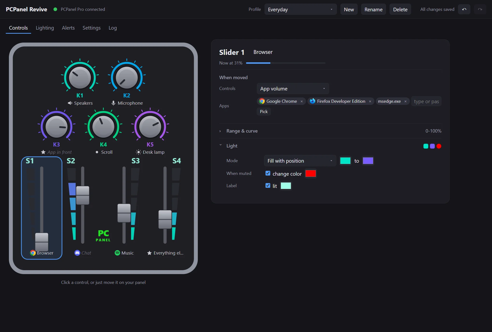

**Why use it instead of the official app?**

- **A live picture of your panel.** Turn a knob and it's selected; LEDs, positions and what each control drives are shown as they really are.
- **Per-app volume with real app icons.** Pick apps from a list or point at a window. "Focused window" and "everything else" are special targets.
- **No volume jumps.** If you changed a volume elsewhere, the dial takes over smoothly instead of snapping it.
- **Notification lights.** For example, K2 pulses purple while Discord has an unread message, or the logo turns red while any app is using your microphone.
- **Music visualizer.** The whole panel dances to whatever is playing and flashes on the beat.
- **More than volume.** Knobs can scroll, zoom, change brush size or dim your smart lights.
- **Twice the controls.** Hold a knob for a second layer of functions, like a Shift key, or turn a slider into a profile switch.
- **Many button actions,** with press, double press and hold on every knob, plus an on-screen cheat sheet of what everything does.
- **Nothing lost.** It autosaves, has undo/redo and keeps automatic backups.
- **Easy switch.** It imports your profiles from the official software in one click.

---

## Getting started

1. **Download** `pcpanel-revive.exe` from the [Releases](../../releases) page and put it anywhere, e.g. `C:\Tools\`.
2. **Quit the official PCPanel software** (right-click its tray icon > Exit). Only one app can talk to the panel at a time.
3. **Run `pcpanel-revive.exe`.** A tray icon appears, and your panel is detected within a couple of seconds.
4. **Left-click the tray icon** to open the settings. Right-click it for profiles, *Start with Windows* and *Quit*.
5. **New to PCPanel?** Click **Quick setup** in the banner (or *Settings > Quick setup*) for a ready-made layout: speakers, mic, the app in front, chat, music, browser and more, based on the apps on your PC. It's added as a new profile.

   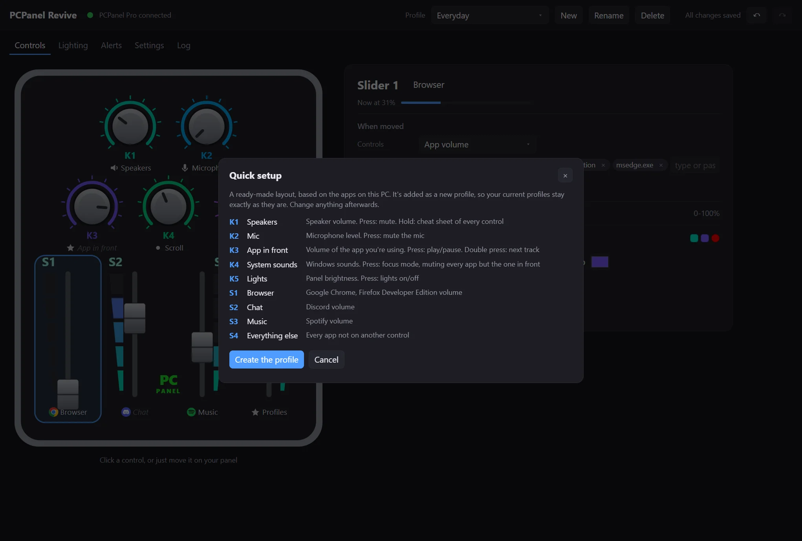

> **"Windows protected your PC"?** The exe isn't code-signed yet, so SmartScreen may warn you the first time. Click **More info > Run anyway**.

### Bring over your old setup

If you used the official software on this PC, a banner offers to import your profiles. One click brings over your knobs, sliders, buttons, trims and lighting, and lists anything it couldn't carry across. **Undo** takes it back.

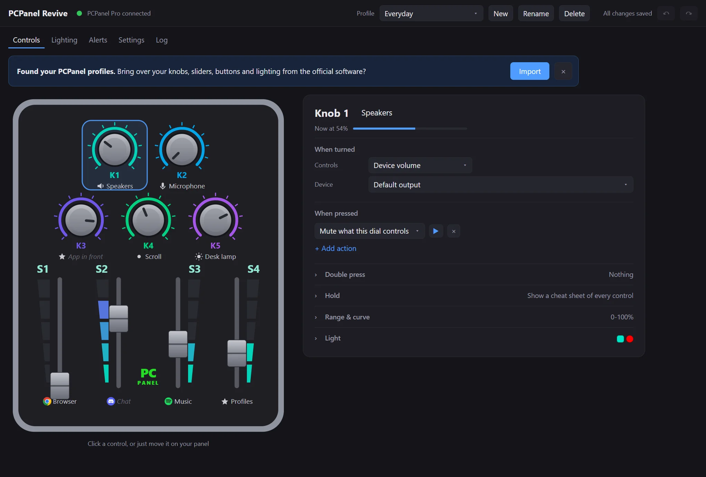

Moving to a new PC? Copy `%LOCALAPPDATA%\PCPanel Software\save.json` from the old one and use **Settings > Import a save.json file**.

---

## Guide

### Setting up a knob or slider

Click a control on the picture, or just **move it on your panel**, and its settings open on the right. Changes save automatically; **↶ / ↷** (Ctrl+Z / Ctrl+Y) undo and redo.

Each control has:

- **When turned / moved:**
  - app volume
  - device volume (speakers, mic, or a specific device)
  - OBS source volume
  - a Voicemeeter parameter
  - a command
  - the panel's LED brightness
  - **keystrokes as you turn:** one key or scroll step per step turned. Scroll a page, zoom (Ctrl + wheel), change brush size in Photoshop with `]` / `[`, or step through a video timeline.
  - **a smart light dimmer:** sends the level to Home Assistant, Philips Hue or any web address as you turn. Pick *Start from: Home Assistant* or *Philips Hue* and fill in your address, token and light.
- **When pressed** (knobs): a list of actions, each with a **▶** button to try it right away.
- **Double press** and **Hold:** more actions on the same knob.
- **Range & curve:** limit it to e.g. 20-80%, invert it, or use a logarithmic curve for finer control at low volume.
- **Light:** the control's LED colors (see [Lighting](#lighting)).

The live readout ("Now at 55%") shows the real volume. A dimmed caption means the app isn't running or the device isn't connected.

### Picking apps

Type or paste exe names (`spotify`, `discord.exe`; commas work), or click **Pick**:

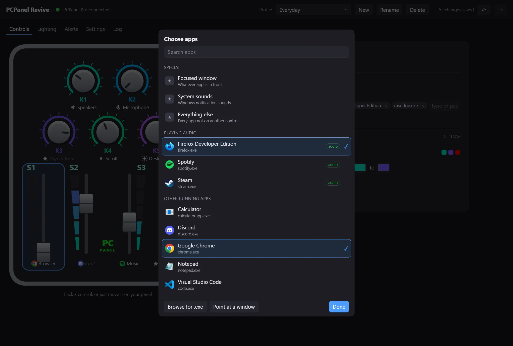

- **Special:**
  - *Focused window:* whatever app is in front.
  - *System sounds.*
  - *Everything else:* every app not on another control.
- **Playing audio** and **Other running apps,** with their real icons and names.
- **Browse for .exe:** for apps that aren't running.
- **Point at a window:** click it, then click any app's window.

### Button actions

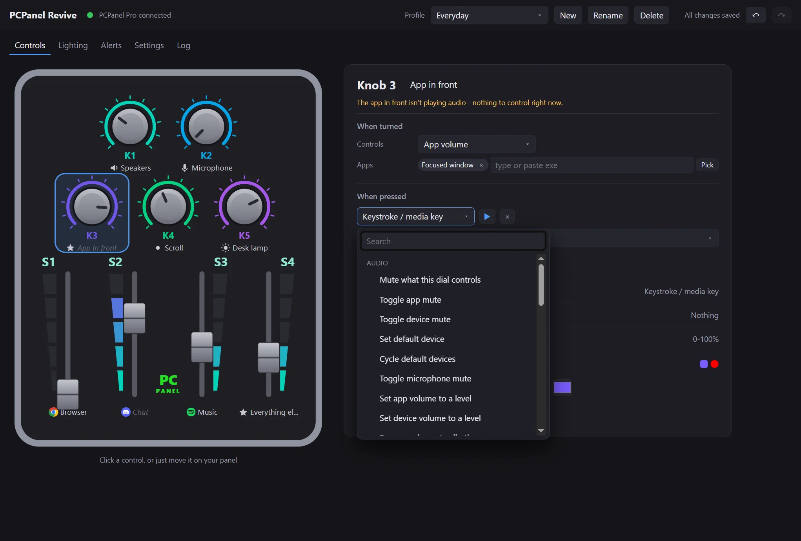

| Group | Actions |
|---|---|
| Audio | Mute what the dial controls · Toggle app / device / microphone mute · Set or cycle the default device · Set an app or device to a preset volume · Focus mode (mute every app except some) · Send an app to a specific audio device |
| Keyboard & apps | Keystroke or media key (or **record** a shortcut) · Run a program · Focus or open an app · Open a website, file or folder · Type text · Kill a process |
| Profiles | Switch to a profile · Next profile · Shift: use another profile while the knob is held |
| OBS | Switch scene · Toggle a source's mute · Toggle recording / streaming |
| Web & smart home | Web request (Home Assistant, webhooks) with method, URL, headers and body |
| System | Lock PC · Turn displays off/on (all, or chosen monitors) |
| Voicemeeter | Run a Voicemeeter script |
| Panel | Turn the panel lights on/off · Show a cheat sheet of every control |

### Lighting

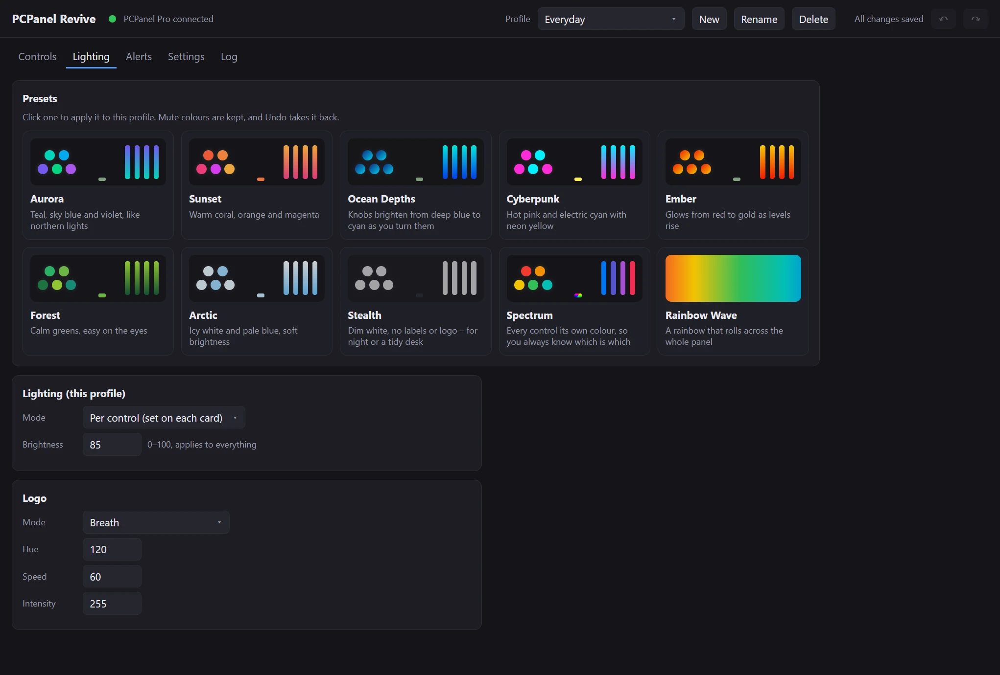

- **Presets:** 12 ready-made looks. Click one to apply it to the current profile; Undo goes back. **Save this profile's lighting as a preset** keeps your own look (every light, the logo, brightness and the visualizer) to apply to any profile; your presets can be renamed and deleted.
- **Music visualizer:** on top of your normal lighting, turn it on *while audio is playing* (optionally only for chosen apps, like Spotify) or *all the time*. While it runs, everything dances to what your speakers play: on the Pro, the sliders show bass, low mids, high mids and treble, the knobs pulse with the same bands and flash on the beat, and the logo follows the overall level. When the music stops, your lighting comes back. Under *Lights* you can limit it to some lights, e.g. just the sliders, and the rest keep their usual look. Move a knob or slider while it runs and that light shows the control's position for a moment, then goes back to the music. Styles: rainbow bands, two colors of your own (quiet to loud), or one color with everything pulsing together to the beat. One-click visualizer presets (Party, Neon Club, Bonfire, Synthwave, Toxic, Heartbeat, Deep Sea, Strobe) change only the visualizer, not your lighting. It only listens to the speakers' output, and nothing is recorded.

  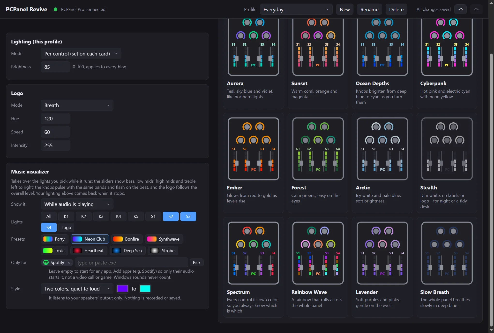

- **Per control:** static, gradient, fill with position, **meter** (pulses with the control's audio), or **real volume**.
- **When muted:** turn a control's LED a color of your choice (e.g. red) while its app or device is muted.
- **Whole panel:** single color, rainbow, wave or breath, plus the logo and slider labels on the Pro.

### Notification alerts

Light up, pulse or blink any knob ring, slider or the logo while an app wants your attention.

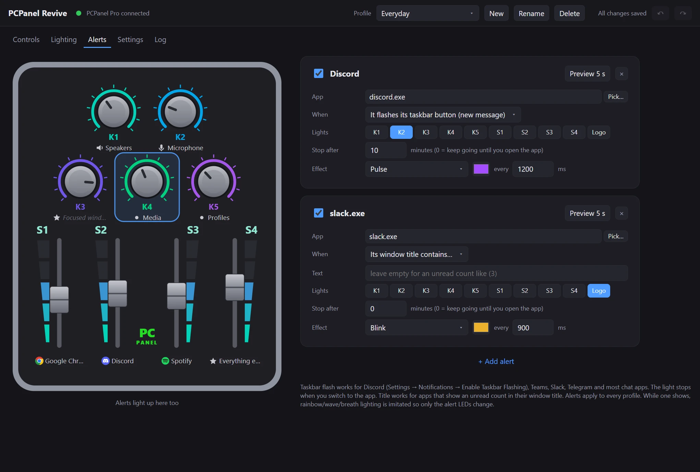

- **When it flashes its taskbar button:** Discord, Teams, Slack, Telegram and most chat apps do this for new messages. For Discord, make sure *Settings > Notifications > Enable Taskbar Flashing* is on.
- **When it shows a Windows notification:** for apps like Outlook or Teams that pop up a notification instead.
- **When its window title contains some text:** for apps that show an unread count like "(3)", or any text you choose.
- **When it's using the microphone (on air):** leave the app empty to light up whenever any app is using a mic, e.g. during a call or a stream. **+ On-air light** adds one in a click.
- **Clearing:** the alert clears when you switch to the app, or after the **Stop after** time.
- **Preview 5 s:** shows it on your panel.
- **Scope:** alerts apply to every profile.

### Volume popup and "no volume jumps"

A small card shows what you're changing, and fades away after a moment:

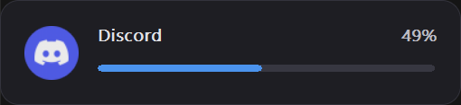

If an app's volume was changed somewhere else (like the Windows mixer), turning its dial won't make it jump. The popup shows the real level and where to move the dial ("Move to 47% to take over"). You can turn both features off in Settings.

### Profiles

- Create, rename and delete profiles from the header, and switch between them from the tray, the header, or a knob button.
- **Auto-switch:** a profile can turn on automatically while a chosen app (e.g. a game) is in front.
- **Share:** *Settings > Export this profile* saves a `.pcpanel.json` file; *Import a profile file* adds one.
- **Shift layer:** add *Shift: use another profile while held* under a knob's **Hold**. While you hold that knob, every other control does what it does in the other profile; let go and it's back. Under a press instead, it stays until you press that knob again.
- **Profile slider** (Pro): *Settings > Profile slider* turns one slider into a profile switch. Its light fills up to where it is: the first profile you list is at the bottom, up to one segment lit, the next is two lit, and so on, and the last one keeps the rest of the way up. Up to five profiles, one per segment, and you can tell which one is on at a glance: give each profile its own fill color, or blend from a bottom color to a top color so every segment has its own shade.
- **Cheat sheet:** add *Show a cheat sheet of every control* to a button. Under Hold, a map of your panel appears on screen while you hold it: a card for each knob and slider, laid out as on the device and marked in its light color, with what turning, pressing, double pressing and holding it does. After a Shift action, it shows the other profile.

  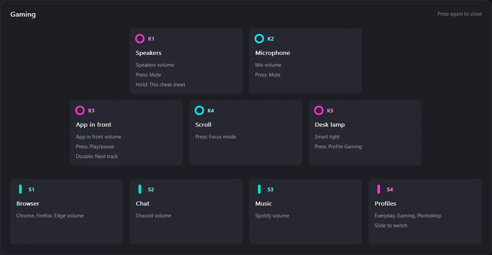


### Settings, self-test and backups

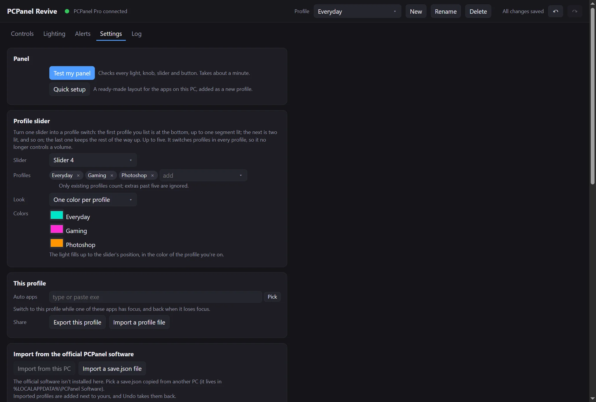

- **Test my panel** checks every light, knob, slider and button in about a minute. Your volumes don't change while it runs.

  | Lights | Controls |
  |---|---|
  | 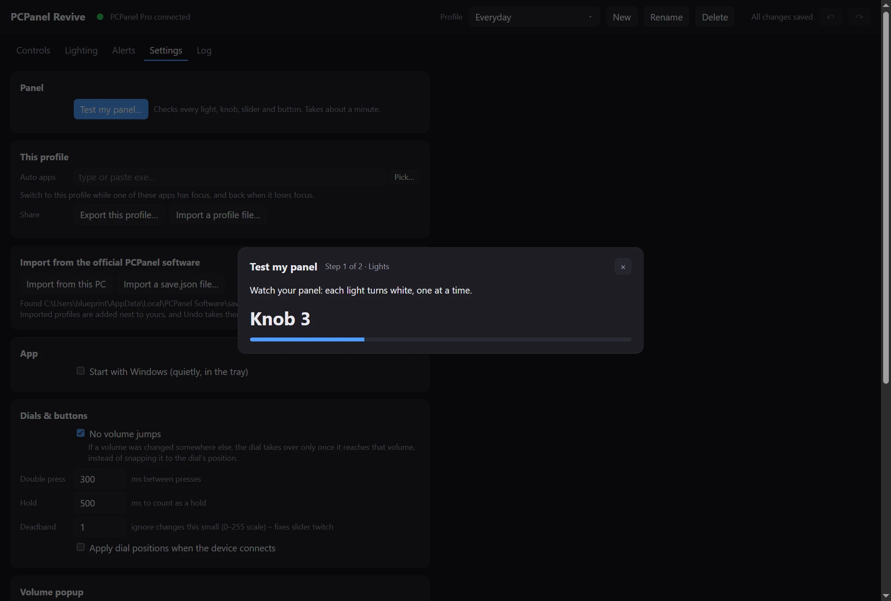 | 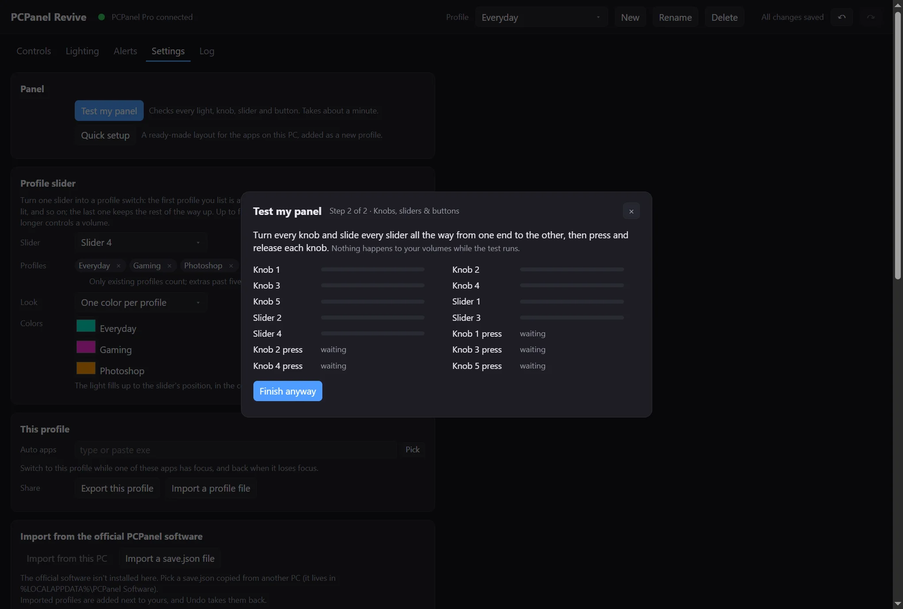 |

- **App:** Start with Windows (quietly, in the tray).
- **Dials & buttons:** no-volume-jumps, double-press and hold timing, a deadband against slider twitch.
- **Volume popup:** on/off and position.
- **Backups:** snapshots are taken automatically (at most every 10 minutes, last 10 kept), with one-click Restore.
- **Updates:** once a day the app checks GitHub for a new version. *Update now* (here or in the tray menu) downloads it, checks it against its published checksum, and restarts into it.

### PCPanel Mini and the original

The settings window draws whichever model is connected.

| PCPanel Mini | Original (wooden) |
|---|---|
| 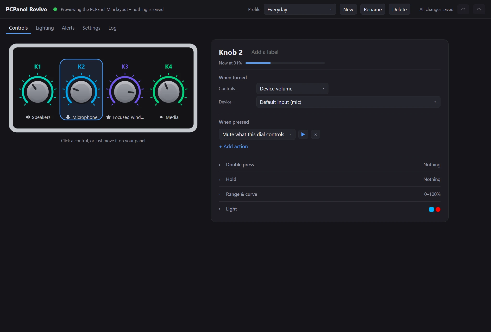 | 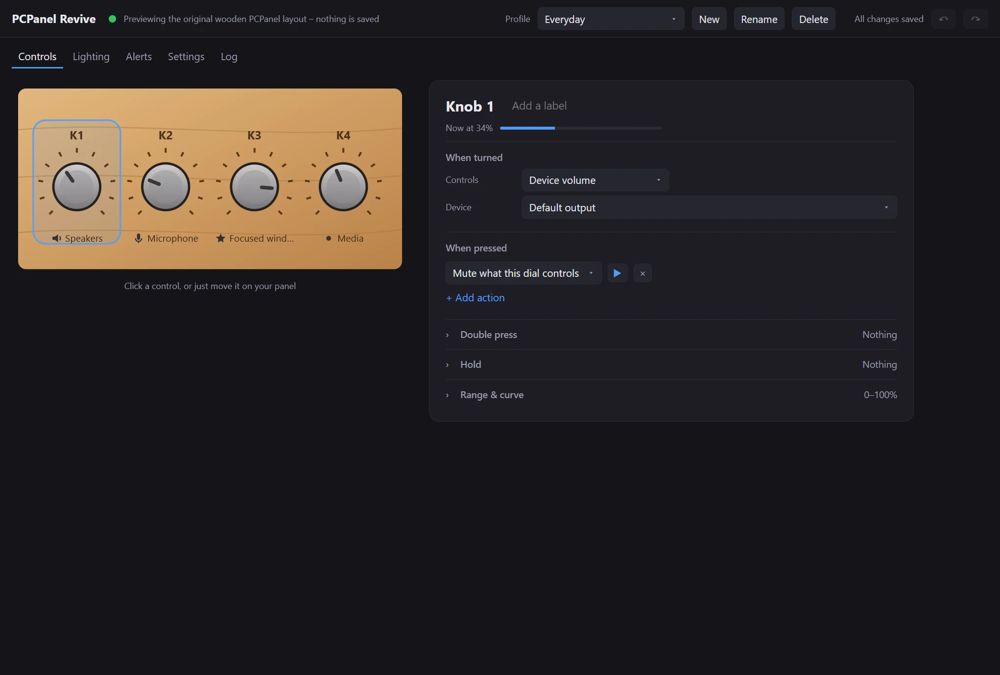 |

The original wooden PCPanel has no lights, so lighting and alerts are hidden for it. Both work with the same protocol as the official software, but haven't been tested on real hardware yet. Reports are welcome.

---

## Troubleshooting

| Problem | Try |
|---|---|
| "PCPanel not found" | Quit the official PCPanel software, then unplug and replug the panel. |
| A button does two things, or lights and volumes "fight" | The official software is still running in the background (it shows up as `javaw.exe`). The app warns you about this; click **Close it**. |
| A knob does nothing | Check its caption. If it's dimmed, the app isn't running. The ▶ button tests the action directly. |
| Discord alert never lights | Turn on Discord's *Settings > Notifications > Enable Taskbar Flashing*. |
| Something went wrong | *Log > Open log file*. The full history, including any crash details, is in there. |

**Where things are stored:** `%APPDATA%\pcpanel-revive\`
- `config.json`: your settings. The app reloads it if you edit it by hand.
- `backups\`: automatic snapshots.
- `pcpanel-revive.log`: the log.

---

## Building from source

Requires [Rust](https://rustup.rs) (stable) on Windows.

```
cargo build --release
cargo test --release
```

The exe is `target\release\pcpanel-revive.exe`. Pushing a `v*` tag builds it on GitHub Actions and attaches it to a release.

### How it works

- **Tray app:** talks to the panel over USB HID, Windows audio over WASAPI, and OBS over its WebSocket.
- **Settings window:** a separate process (`--settings`) showing the UI in WebView2, which comes with Windows 10/11. It exists only while the window is open, so the tray app stays small.
- **Local server:** the tray app serves the UI on `127.0.0.1:47831` to the settings window only.

### Driving the settings window from tools

`pcpanel-revive.exe --settings --devtools` opens the window with Chromium's DevTools protocol on `127.0.0.1:9222`; `PCP_DEVTOOLS_PORT` changes the port. Point a DevTools client such as [Chrome DevTools MCP](https://github.com/ChromeDevTools/chrome-devtools-mcp) (`--browserUrl http://127.0.0.1:9222`) at it to script the UI, take screenshots, click and type inside the app without using your mouse and keyboard.

Add `?preview=mini` or `?preview=original` to the page address to see another model's layout; nothing is saved in preview. Don't use `--devtools` day to day: while it's on, any program on the PC can control the page.

## Credits

The USB protocol details come from the community projects [nvdweem/PCPanel](https://github.com/nvdweem/PCPanel) and [neoyagami/PanelPCLlit](https://github.com/neoyagami/PanelPCLlit). PCPanel is a product of [getpcpanel.com](https://www.getpcpanel.com); this project isn't affiliated with it.

## License

PCPanel Revive is free software, released under the [GNU General Public License v3.0](LICENSE) or (at your option) any later version. You can use, study, share and change it. If you distribute a modified version, it has to stay open source under the same license.

It comes with no warranty.
